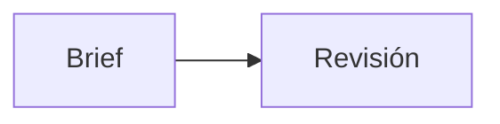

## Resultado esperado

Contenido verificable de la sección 1.

## Pedido interpretado

Contenido verificable de la sección 2.

## Audiencia, problema y acción

Contenido verificable de la sección 3.

## Evidencia, fuentes y supuestos

Contenido verificable de la sección 4.

## Propuesta creativa

Contenido verificable de la sección 5.

## Steps y milestones

Contenido verificable de la sección 6.

## Deliverables

Contenido verificable de la sección 7.

## Skills y responsabilidades

Contenido verificable de la sección 8.

## Riesgos, límites y casos borde

Contenido verificable de la sección 9.

## Criterios de aceptación

Contenido verificable de la sección 10.

## Diagrama

## Decisión y siguiente gate

Contenido verificable de la sección 12.
